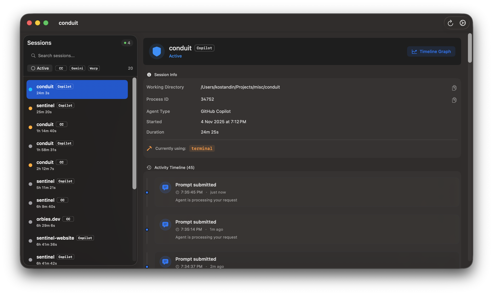

[Web](https://sentinel.orbies.dev/) | [Github](https://github.com/kostandinang/sentinel)

Sentinel is a macOS menu bar app that shows what your AI agents are doing in real-time.

### What It Does

When you're working with Claude Code or other agents, Sentinel sits in your menu bar and shows you:
- What the agent is currently doing
- Which tools it's using
- When it completes tasks
- A timeline of everything that happened

Think of it as a "task manager" for your AI agents.

### How It Works

The app uses a simple hook system. Claude Code sends events to Sentinel through a custom URL scheme (`sentinel://`). Each time the agent starts thinking, uses a tool, or finishes a task, Sentinel gets notified and updates the display.

The menu bar icon changes color based on what's happening:
- Gray shield: agent is idle
- Blue shield: agent is thinking
- Orange shield: agent is using tools
- Red shield: something went wrong

### Why I Built This

As I began using AI agents more often, I noticed a pattern: the more capable they became, the less I understood what they were doing.

A task would start, the terminal would go quiet, and I’d be left wondering, is it working, waiting, or stuck? The more sense does this make, when there are multiple running in parallel.

Sentinel emerged from that gap. It’s a small effort to make the invisible visible, to bring a sense of awareness back into automation. When you can see what’s happening, even at a glance, you regain context. You notice patterns, spot failures sooner, and develop intuition for improvement

It’s not about control for its own sake. It’s about understanding.